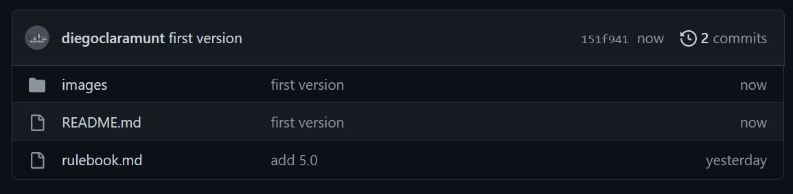
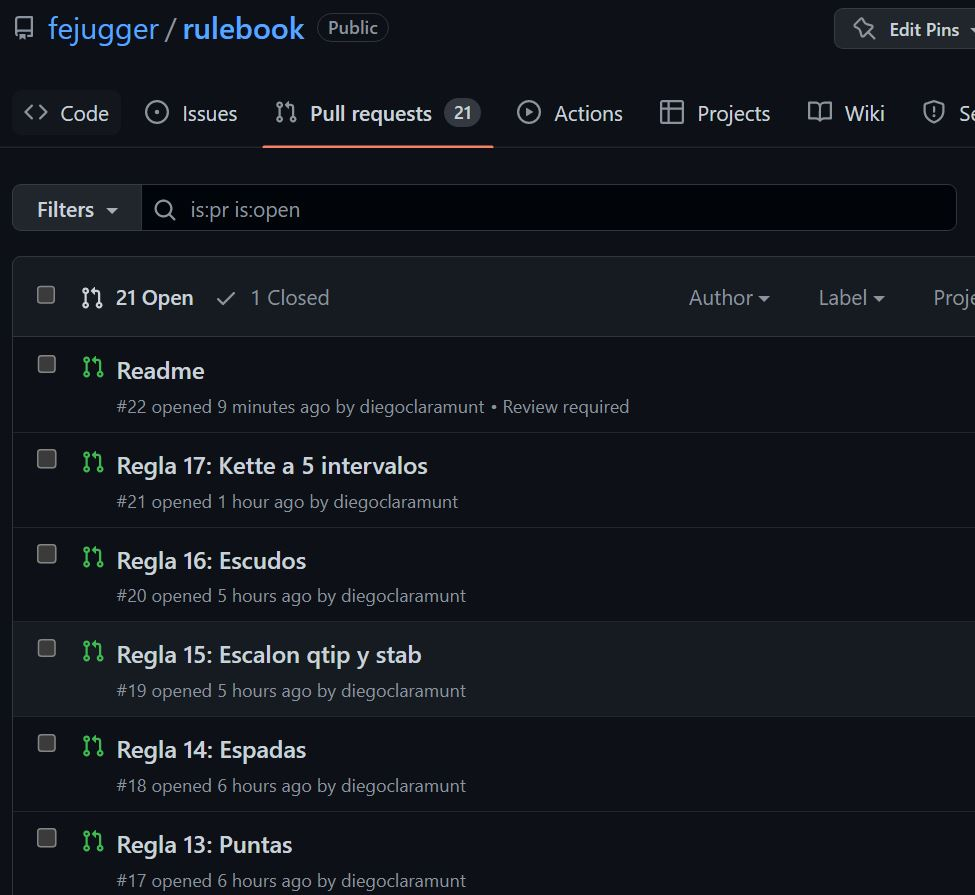
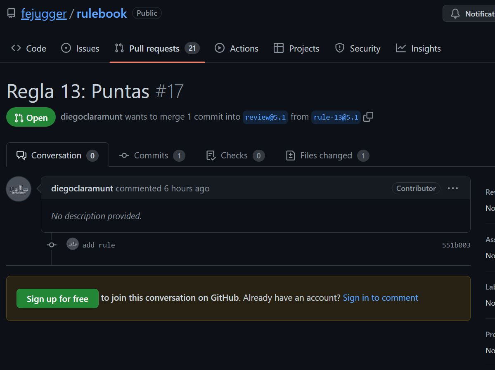
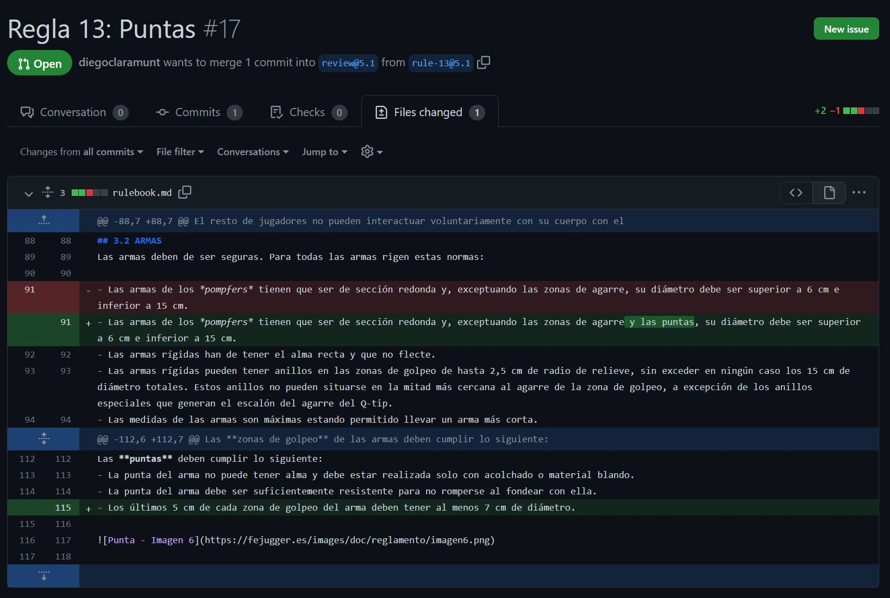
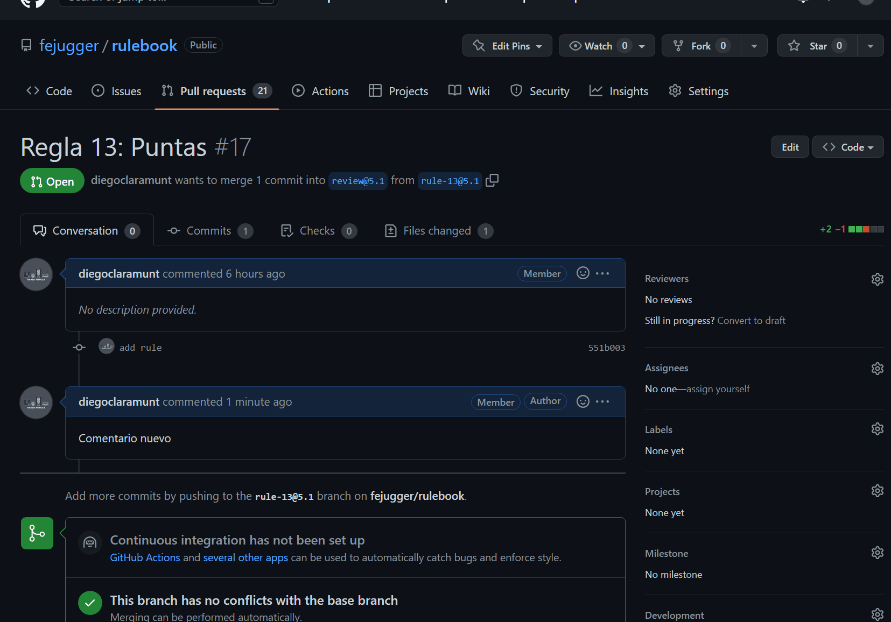
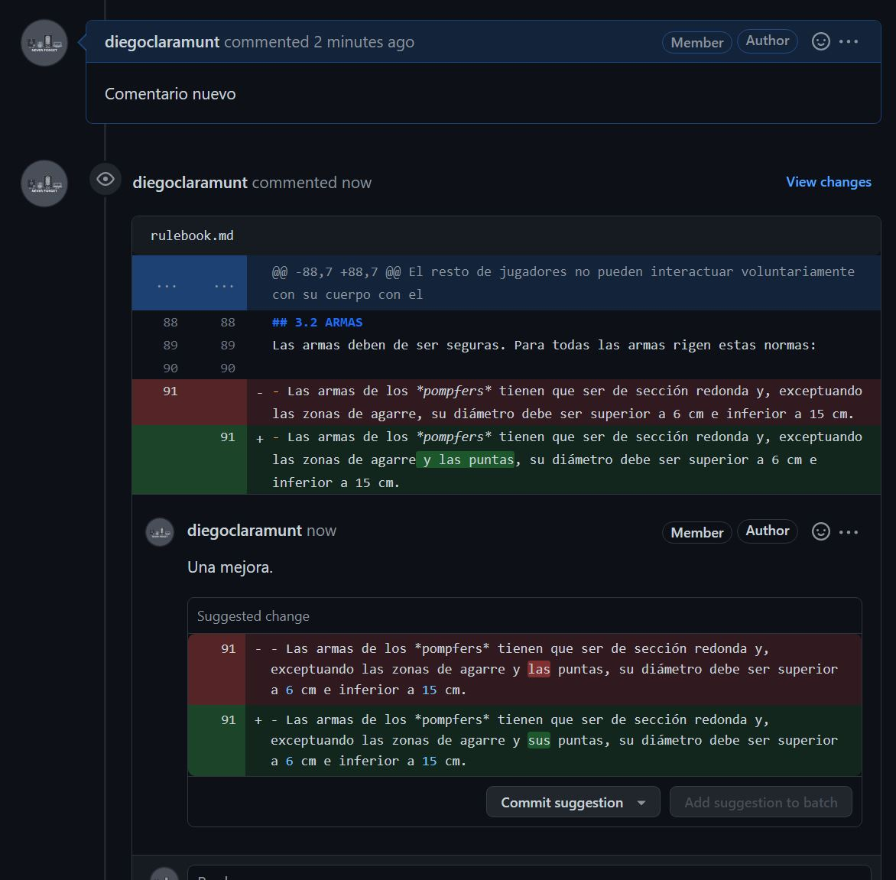

# Reglamento de Jugger

Bienvenido al repositorio del reglamento de jugger de La Federación Española de Jugger.

Actualmente el reglamento se encuentra en su versión 5.0

- [Reglamento](./rulebook.md)
- [¿Cómo veo los cambios propuestos?](#solicitudes-de-cambios)
- [¿Cómo creo un debate o realizo una pregunta?](#crear-un-debate-o-realizar-una-pregunta)

## ¿Por qué un repositorio?
Con el objetivo de aumentar la transparencia del proceso de revisión del reglamento y democratizar la participación de los jugadores en los debates de las normas utilizamos un repositorio con control de cambios.

De esta manera, cada interacción sobre el documento puede ser trazada y conocer quién y cuando realizó cualquier cambio.

Del mismo modo aprovechamos la funcionalidad del servicio web para poder tener de manera centralizada y disponible debates sobre las normas ([issues](https://github.com/fejugger/rulebook/issues)) y solicitudes de cambio ([pull request](https://github.com/fejugger/rulebook/pulls)).

De esta manera, los jugadores puede generar un nuevo debate en el momento en que surja la duda sin necesidad de esperar a un plazo determinado ni a un formulario que se cierra.

Del mismo modo, al estar 100% disponible online y actualizado en tiempo real, el repositorio servirá para añadir aclaraciones sobre normas que tendrá vigencia sin necesidad de tener que esperar al cambio de reglamento.

## ¿Cómo funciona el repositorio?
Un repositorio es un almacén de ficheros sobre los que se realiza con un control de versiones. Es decir, un fichero de texto con información adicional sobre los cambios que se han realizado sobre el mismo.

Todos los ficheros sobre los que se realiza el control de versiones se pueden ver en la pestaña _code_.

Al hacer click en un fichero, podemos ver su contenido. De manera adicional, también podemos ver cuando se modificó por última vez.

El reglamento se encuenta en el fichero [rulebook.md](./rulebook.md)

La extensión _.md_ hace referencia a un archivo de texto con formato que utiliza sintaxis especial para dar formato a los contenidos. Es un acrónimo de "Markdown". Se utiliza principalmente para documentar proyectos, crear artículos en sitios web y para escribir mensajes en plataformas de discusión.

En lugar de utilizar código HTML o lenguaje de marcado para dar formato al texto, Markdown utiliza una sintaxis sencilla y fácil de aprender. Por ejemplo, los títulos se escriben con "#", las listas con "-" y las citas con ">".

Al guardar un archivo con la extensión .md, se puede visualizar en un formato legible en un editor de texto o se puede convertir a HTML o PDF para su publicación en un sitio web o para su impresión.

Puedes encontrar más información en el [siguiente enlace](https://tutorialmarkdown.com/).

## Solicitudes de cambios
El repositorio gestiona las modificaciones a través de las [pull request](https://github.com/fejugger/rulebook/pulls).

Generalmente cada solicitud de cambio representará una regla nueva para ser votada por los representantes.

Una _pull request_ es una solicitud de cambios sobre el contenido actual. Una _pull request_ esta formada por un nombre, una descripción y los cambios que se proponen.

Al crear una _pull request_, automaticamente se abre un debate sobre el mismo en el que cualquier usuario registrado puede participar.

Para ver los cambios, simplemente es necesario ir al elemento _Files changed_ del menú.

Para notificar los cambios se utiliza un código de colores muy sencillo:
- En rojo las líneas de texto que se eliminan.
- En verde, las líneas de texto que se añaden.
- En verde destacado, el contenido exacto que varía.

De manera adicional, podemos ver los cambios en formato _enriquecido_.

También podemos ver el resultado final del contenido modificado.

### Añadir comentarios sobre algún cambio específico
Los usuarios registrados pueden añadir comentarios sobre la solicitud en general o sobre alguna parte del contenido.

## Crear un debate o realizar una pregunta

TBD
