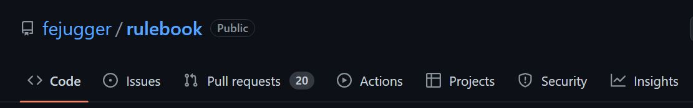

# Reglamento de Jugger

Bienvenido al repositorio del reglamento de jugger de La Federación Española de Jugger.

Actualmente el reglamento se encuentra en su versión 5.0

## ¿Por qué un repositorio?
Con el objetivo de aumentar la transparencia del proceso de revisión del reglamento y democratizar la participación de los jugadores en los debates de las normas utilizamos un repositorio con control de cambios.

De esta manera, cada interacción sobre el documento puede ser trazada y conocer quién y cuando realizó cualquier cambio.

Del mismo modo aprovechamos la funcionalidad del servicio web para poder tener de manera centralizada y disponible debates sobre las normas ([issues](https://github.com/fejugger/rulebook/issues)) y solicitudes de cambio ([pull request](https://github.com/fejugger/rulebook/pulls)).

De esta manera, los jugadores puede generar un nuevo debate en el momento en que surja la duda sin necesidad de esperar a un plazo determinado ni a un formulario que se cierra.

Del mismo modo, al estar 100% disponible online y actualizado en tiempo real, el repositorio servirá para añadir aclaraciones sobre normas que tendrá vigencia sin necesidad de tener que esperar al cambio de reglamento.

## ¿Cómo funciona el repositorio?
Un repositorio es un almacén de ficheros sobre los que se realiza con un control de versiones. Es decir, un fichero de texto con información adicional sobre los cambios que se han realizado sobre el mismo.

Todos los ficheros sobre los que se realiza el control de versiones se pueden ver en la pestaña _code_.

Al hacer click en un fichero, podemos ver su contenido.

El reglamento se encuenta en el fichero [rulebook.md](./rulebook.md)