# INTRODUCCIÓN

## JUGGER
El jugger es un deporte de equipo que combina elementos de deportes de pelota con elementos de deportes de lucha, en el que dos equipos de cinco jugadores tratan de marcar tantos e impedir que el equipo contrario lo haga. El jugger se juega con una pelota (llamada *jugg*) y unas armas recubiertas con materiales blandos.

A diferencia de otros deportes similares, solamente un jugador de cada equipo (el corredor o *qwiker*) está autorizado para tocar físicamente el *jugg* y deberá hacerlo con las manos. Para conseguir un tanto debe colocarse el *jugg* en la zona rival, concretamente dentro de una marca (denominada base) situada en cada uno de los dos extremos del terreno de juego. El resto de los jugadores (los *pompfers*) portan armas y las utilizan para enfrentarse a los jugadores del equipo contrario y proteger a su corredor. Al final, el equipo que haya marcado más tantos es el ganador.

## SEGURIDAD ANTE TODO
El jugger es un deporte que no se basa en la fuerza bruta, sino en la habilidad y la estrategia. En este sentido, el Reglamento prohíbe en todo momento los impactos fuertes con las armas y el contacto físico entre jugadores, a excepción de los corredores tal y como se detalla más adelante.

A fin de comprobar la seguridad de las armas de los jugadores, antes de su utilización son sometidas a un exhaustivo control de seguridad. Todas las armas han de tener un acolchado amplio que permita que los impactos con ellas no provoquen daños.

En definitiva, el jugger es un deporte de contacto muy completo, ya que trabaja todo el cuerpo, la mente y el juego en equipo y en el que se minimizan los riesgos.

## REGLAMENTO
Este documento pretende agrupar los conceptos básicos del jugger y servir de base y punto de encuentro para que las diferentes comunidades de jugadores de la geografía española puedan jugar a este deporte bajo las mismas reglas. En caso de contradicción entre reglas prevalecerá la más restrictiva o detallada.

Adicionalmente a este Reglamento se detallan dos anexos. El primero sirve como aclaración de las situaciones que puedan darse en un partido y el segundo como guía de arbitraje para el deporte.

# CAPÍTULO 1: EL CAMPO DE JUEGO

## 1.1 ACOTACIÓN Y DIMENSIONES
El campo de juego tiene la forma de un rectángulo con las esquinas recortadas.

Las líneas más cortas se llaman *líneas de base*. Los equipos deben permanecer en su línea de base al inicio de cada punto.

Las líneas más largas se llaman *líneas de banda*.

Las líneas de banda y las líneas de base se unen mediante las *diagonales*.

Las líneas delimitan la superficie de juego y no forman parte del campo.

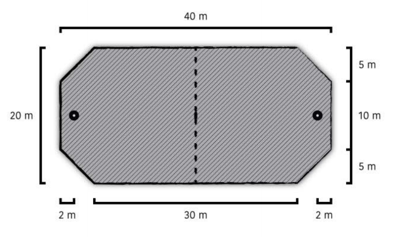

## 1.2 EL CENTRO
En el centro del terreno de juego debe haber una marca bien señalizada donde se debe situar el *jugg* al comienzo de cada punto.

## 1.3 BASE
La base es una pieza con un orificio en el centro en la que hay que colocar el *jugg* para marcar un tanto. Cada una de las dos zonas de marcaje se encuentra en un extremo del terreno de juego. Se sitúan en el centro de la línea de base a 2 m de esta, tal y como aparece en la imagen.

Tienen 50 cm de diámetro aproximadamente, un agujero en el centro de unos 12 cm de diámetro y altura suficiente para que encaje el *jugg*. La zona de marcaje tiene que ser también blanda para evitar daños a los jugadores. Pueden estar parcialmente ancladas al suelo para evitar que los pequeños golpes las desplacen.

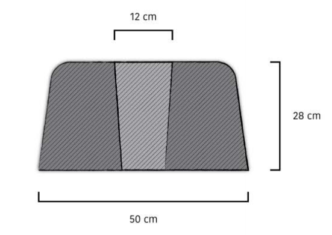

# CAPÍTULO 2: LOS JUGADORES

## 2.1 EQUIPO
Durante un partido un equipo debe contener un máximo de 10 jugadores: 5 en el campo y hasta 5 reservas.

## 2.2 CORREDOR
El corredor o *qwiker* no porta armas y es el único que puede coger el *jugg*.

En el campo debe haber obligatoriamente un corredor en cada equipo.

Es el encargado de indicar si su equipo está listo al empezar un punto.

## 2.3 KETTE
En el campo puede haber como máximo un *kette* en cada equipo.

## 2.4 POMPFERS
El resto de jugadores son llamados *pompfers*. Pueden equiparse con una de las siguientes combinaciones:

- *Q-tip*.
- Mandoble.
- Bastón (también llamado *stab*).
- Espada corta y escudo.
- Dos espadas cortas (también llamadas duales).

Cualquier otra combinación no será considerada válida, y las acciones de ese jugador no serán tenidas en cuenta.

## 2.5 CAPITÁN
Es el portavoz con respecto al equipo arbitral. Por tanto, es quien debe dirigirse por norma general al mismo para tratar cualquier duda sobre el desarrollo del juego durante las pausas del mismo. Será a él a quien se notifiquen las decisiones arbitrales.

Antes del comienzo del partido, el capitán deberá identificarse como tal en el acta en la casilla correspondiente.

## 2.6 ZONA DE EQUIPO
Durante el transcurso de un punto, los jugadores que no formen parte de la línea solo podrán permanecer en la zona de su equipo. La zona de equipo (resaltada en verde en la imagen) equivale a la superficie exterior al campo desde el inicio de las líneas de banda hasta detrás de la línea de base que le corresponde a su equipo. Estos jugadores no podrán interferir en el desarrollo del partido, ni dirigirse al equipo rival ni al equipo arbitral.

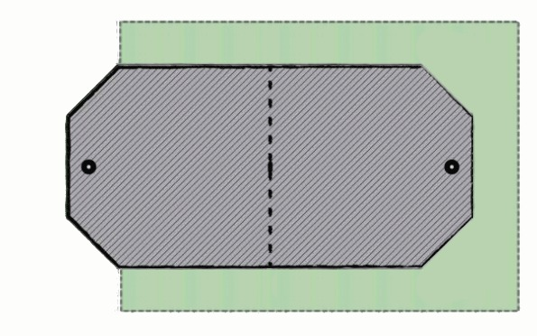

# CAPÍTULO 3: EQUIPAMIENTO

## 3.1 JUGG
El *jugg* es el objeto que el corredor ha de situar en la zona de marcaje para conseguir un tanto. Ha de medir entre 28 y 30 cm de largo y tener un extremo sensiblemente más estrecho que el otro, con diámetros de entre 12 y 15 cm en su lado ancho y entre 8 y 10 en su lado estrecho. Los *juggs* deben ser blandos, seguros y no podrán tener un alma rígida en su interior.

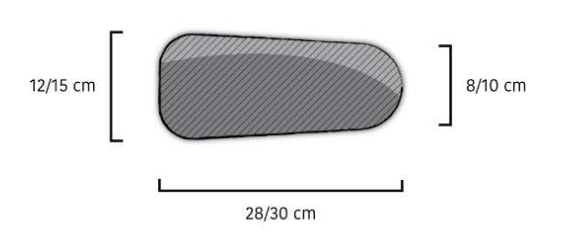

El corredor es el único jugador que puede coger, llevar y lanzar el *jugg* para así conseguir tantos para su equipo. El corredor no puede lanzar el *jugg* contra sus rivales, ni tiene permitido darle patadas. Los corredores sí podrán frenar el *jugg* usando el cuerpo.

El resto de jugadores no pueden interactuar voluntariamente con su cuerpo con el *jugg*, solo pueden moverlo golpeándolo con sus armas, pero nunca transportarlo utilizando, por ejemplo, dos espadas a modo de pinza o un escudo como bandeja.

## 3.2 ARMAS
Las armas deben de ser seguras. Para todas las armas rigen estas normas:

- Las armas rígidas tienen que ser de sección redonda y, exceptuando las zonas de agarre, su diámetro debe ser superior a 6 cm e inferior a 15 cm.
- Las armas rígidas han ser rectas y no pueden flectar.
- Las armas no pueden tener **anillos** en la zona de golpeo, a excepción de los refuerzos especiales que generan el escalón del agarre del *Q-tip* y el *stab*.
- Las medidas de las armas son máximas, estando permitido llevar un arma más corta.
- Las armas no deben exponer sus materiales internos y deben estar cubiertas por algún tipo de material no abrasivo.
- Los pomos de las armas son considerados zonas de agarre válidas y deben estar **mínimamente acolchados**, siendo obligatorio únicamente cubrir la base.
- Las armas deben ser lo suficientemente seguras como para no causar daños al impactar.

Se considera un **anillo** a una ampliación en el relieve del acolchado que se sitúe en cualquier parte de la zona de golpeo de un arma. No serán considerados anillos los refuerzos necesarios para hacer que la punta sea segura.

Se considera una superficie **mínimamente acolchada** cuando, al aplicar una leve presión sobre el material, este cede parcialmente. Asimismo, debe llevar una capa externa de recubrimiento no abrasivo. El acolchado deberá ser fijo y no desplazarse.

Las **zonas de golpeo** de las armas deben cumplir lo siguiente:

- El alma del arma no puede notarse apretando con un dedo en cualquier parte de la zona de golpeo. A excepción del ***Q-tip***, las zonas de agarre **NO** precisan ser acolchadas.
- Las zonas de golpeo deberán estar adecuadamente acolchadas.
- Todos los bordes deben ser redondeados y no deben presentar aristas.
- Las zonas de golpeo no deben producir arañazos al resto de jugadores.
- Las zonas de golpeo deben medir **al menos 40 cm** de longitud.
- Debe existir una diferencia de al menos 2 cm de diámetro en la unión entre las zonas de acolchado y las de agarre de algunas armas. Esta diferencia puede generarse con el propio acolchado o con un refuerzo de al menos 4 cm de longitud siempre que se mantenga el mínimo de 6 cm de diámetro. Se resaltan en los dibujos de cada arma las zonas en las que tiene que existir dicha diferencia.

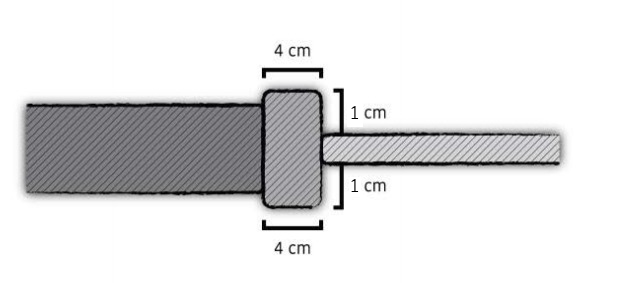

Las **puntas** deben cumplir lo siguiente:

- La punta del arma no puede tener alma y debe estar realizada solo con acolchado o material blando.
- La punta del arma debe ser lo suficientemente resistente como para no romperse al fondear con ella.
La punta puede tener un refuerzo para hacerla más segura siempre y cuando no genere una diferencia en el radio del arma de más de 2 cm ni supere el diámetro máximo permitido de 15 cm. Este refuerzo no deberá tener una longitud menor a 5 cm ni mayor a 10 cm.

**Punta sin refuerzo**

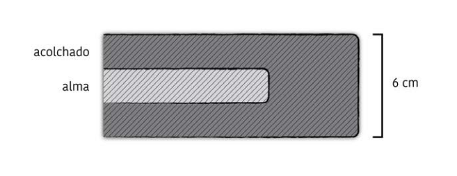

**Punta con refuerzo**

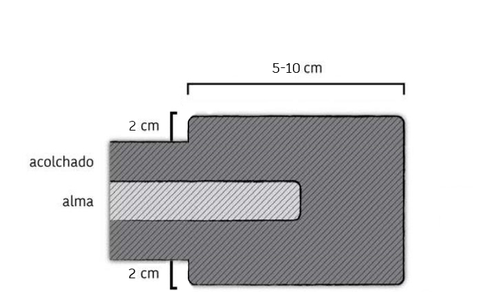

### 3.2.1 Q-tip
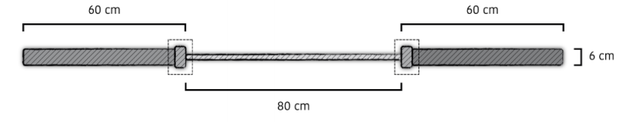

El *Q-tip* tiene unas dimensiones máximas de 200 cm. Tiene una zona de agarre central que debe estar **mínimamente acolchada**, y dos zonas de golpeo situadas en los extremos de hasta 60 cm. Es un arma que debe utilizarse con las dos manos, pudiéndose situar cada una en cualquier parte de la zona de agarre.

### 3.2.2 Bastón o stab
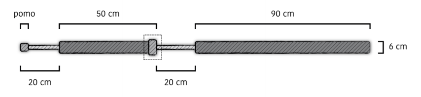

El *stab* tiene unas dimensiones máximas de 180 cm. La zona de impacto está situada en un extremo y mide 90 cm. La zona entre los dos agarres no se considera zona de golpeo válido, aunque debe estar acolchada y tener un mínimo de 4 cm de diámetro.

Es un arma a dos manos con dos zonas de agarre separadas, y solo produce impactos válidos cuando se usan ambos agarres simultáneamente. No está permitido fondear o estocar con el *stab*.

### 3.2.3 Mandoble
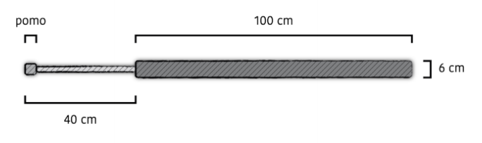

El mandoble tiene unas dimensiones máximas de 140 cm. La zona de golpeo mide 100 cm y la zona de agarre mide 40 cm.

Es un arma a dos manos.

### 3.2.4 Espada corta
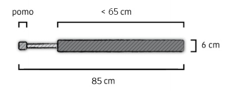

La espada corta tiene unas dimensiones máximas de 85 cm. La zona de golpeo puede medir hasta 65 cm, y la zona de agarre hasta 25 cm. En ningún caso la longitud total puede superar la medida máxima definida.

Es un arma a una mano y puede agarrarse desde cualquier parte de su zona de agarre. Puede combinarse con otra espada corta o con un escudo en la otra mano.

### 3.2.5 Escudo
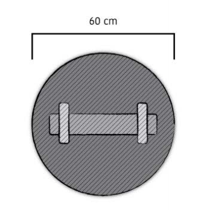

El escudo debe ser redondo y tener un diámetro de 60 cm y un grosor de hasta 25 cm (sin incluir el agarre). Ambas caras del escudo deben ser sólidas, planas y rectas (sin contar los agarres y correas ni sus fijaciones). El centro del escudo puede tener una cazoleta de hasta 25 cm de diámetro para el agarre. El grosor de la cazoleta y el del escudo no pueden superar el grosor máximo definido. El escudo debe sujetarse desde el agarre y puede fijarse al brazo mediante correas.

Se usa con una sola mano y es considerado un arma no ofensiva por lo que **NO** está permitido atacar con el escudo. Debe tener el borde y el frontal siempre acolchados.

### 3.2.6 Kette
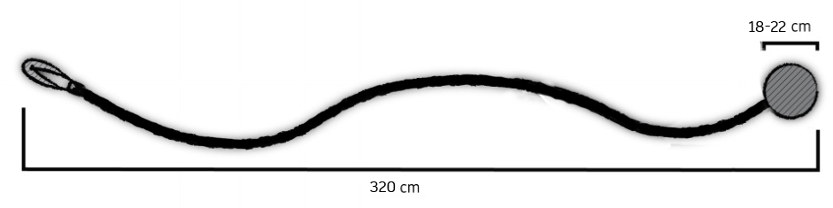

El *kette* tiene unas dimensiones máximas de 320 cm. El *kette* está formado por una bola de entre 55 cm y 77 cm de perímetro (18-22 cm de diámetro) y un conjunto de enlace y agarre de longitud variable. En ningún caso la longitud total puede superar la medida máxima definida.

La bola debe ser una esfera de material blando que **NO** puede estar cubierta en su totalidad con cinta. Las medidas de la bola no pueden variar del rango definido. Es decir, la bola no se beneficia de la regla de que las medidas son máximas.

La bola no puede unirse al enlace con materiales metálicos o rígidos. El conjunto de enlace y agarre no podrá contener ningún elemento metálico ni rígido o duro.

El enlace debe tener al menos 2 cm en una de sus dimensiones, y no puede ser de sección cilíndrica ni exponer materiales abrasivos en su capa exterior.

El agarre del *kette* deberá poder desprenderse con facilidad del jugador para evitar posibles tirones que pongan en peligro a los jugadores. Todo el conjunto de enlace y bola es considerado una única zona de agarre válida. El *kette* puede realizar impactos válidos siempre que se sujete con al menos una mano.

## 3.3 ARMA ROTA
Si un jugador viera su arma dañada de manera que no fuera posible su empleo garantizando la seguridad en el uso de la misma para sí mismo o para cualquier otro jugador, se considerará que el jugador está inactivo (debiendo levantar este la palma de su mano mientras indica verbalmente «¡Arma rota!») y deberá salir del campo por la ruta más rápida, portando todos los fragmentos de su arma que pudieran resultar peligrosos. Entonces podrá dirigirse a su línea de base a por otra arma.

El jugador deberá incorporarse por la línea de base en cuanto recoja una nueva arma, cumpliendo un tiempo de penalización de 5 intervalos al reingresar al terreno de juego. Si resulta impactado (antes de declarar la rotura del arma) o comete alguna falta, deberá añadir a su tiempo de penalización tantos intervalos como corresponda.

## 3.4 OTRO EQUIPAMIENTO
La indumentaria básica de un jugador se compone de:

- Camiseta o tank top que cubra el tren superior.
- Prenda que cubra parte del muslo (pantalones, mallas, falda, etc.).
- Calzado adaptado a las condiciones del terreno de juego.

Las camisetas deberán llevar un nombre y/o dorsal claramente visibles para poder ser identificados por parte del equipo arbitral. El color de los números debe contrastar con el color de las camisetas.

Los jugadores pueden elegir llevar protectores, rodilleras y guantes, siempre y cuando su uso no suponga peligro para el resto de jugadores.

Los jugadores pueden usar gafas, lentes de contacto y otros objetos o prendas bajo su propia responsabilidad y siempre que estos no supongan un peligro para el resto de jugadores.

No se permite el uso de objetos que puedan proporcionar cualquier tipo de ventaja artificial al jugador.

# CAPÍTULO 4: DESARROLLO DE UN PARTIDO

## 4.1 DURACIÓN DE UN PARTIDO

### 4.1.1 Intervalos
Los intervalos o piedras son el medio sonoro continuo que se utilizan en el jugger con una frecuencia de 1,5 segundos. Los intervalos se marcan con señales acústicas.

### 4.1.2 Puntos
Es el periodo de juego que transcurre desde que el árbitro pregunta al corredor hasta que se logra un tanto, se terminen los intervalos o el árbitro lo indique.

### 4.1.3 Tantos
Para anotar un tanto el corredor debe colocar el *jugg* dentro de la base contraria. El tanto será válido si ningún corredor está tocando el *jugg* y este se mantiene dentro de la base. Si el *jugg* se sale, o ha sido lanzado o dejado caer dentro de la base, el tanto **NO** será válido.

Se considerará que el *jugg* está dentro de la base si al menos la mitad del *jugg* se encuentra dentro.

En caso de que el tanto **NO** sea válido el punto continuará, y un árbitro o un jugador deberán sacar el *jugg* de la zona de marcaje.

No está permitido obstruir el orificio de la zona de marcaje, ya sea con el cuerpo, con la mano o con el escudo.

### 4.1.4 Comenzar un punto
Una vez que los capitanes regresen a su zona de base, ya sea por haber presentado una reclamación o por haber participado en el punto, no podrán presentar reclamaciones al árbitro principal. El árbitro principal podrá indicar a los jugadores el intervalo y la puntuación antes de empezar un punto. Los árbitros principal y secundario darán comienzo al intervalo de preparación del punto **al grito de «¿Corredor listo?»** levantando el brazo derecho hacia el equipo a su derecha.

Con el fin de evitar la pérdida de tiempo por parte de los jugadores, el árbitro principal podrá iniciar este proceso cuando considere oportuno (hayan llegado los jugadores a sus zonas de base o no).

Esta preparación se realizará bajo la cuenta de intervalos del árbitro principal y que deberá seguir el árbitro secundario. Ambos árbitros deberán avisar al llegar a 5 y a 10 intervalos a ambos equipos. El intervalo de preparación finalizará en los siguientes casos:

- Cuando ambos corredores indiquen que su equipo se encuentra preparado.
- Cuando la cuenta de intervalos llegue a 10, hayan indicado o no los corredores que sus equipos se encuentran preparados

Para indicar que un equipo se encuentra **preparado**, su corredor debe indicarlo al equipo arbitral levantando claramente su brazo extendido hacia arriba y adelante. Opcionalmente, puede indicar que **NO** se encuentran preparados alzando los brazos en cruz. Dichas señales serán válidas cuando el árbitro correspondiente se haya percatado de ellas.

Cuando un corredor esté listo o termine la cuenta, el árbitro debe poner el brazo en horizontal orientado hacia el centro del campo para indicar que está listo. Cuando ambos árbitros estén listos, el árbitro principal gritará «¡3, 2, 1, jugger!». En el instante en el que termine de pronunciar la palabra «jugger», los árbitros han de bajar el brazo hasta la posición natural y se dará comienzo el punto, pudiendo entonces entrar en contacto con el campo.

### 4.1.5 Formación de la línea
Al comienzo de cada punto, cada equipo deberá elegir hasta 5 jugadores que entrarán en el campo para el desarrollo del punto.

Los jugadores tienen la obligación de entrar al campo cuando el árbitro dé la salida. La entrada debe hacerse exclusivamente por la línea de fondo de su zona de base.

Durante el partido cada equipo podrá realizar tantos cambios en esta formación como desee, siempre que se realicen antes del inicio de cada punto.

Un jugador que entre al campo con un arma no podrá cambiarla durante el transcurso de un punto a no ser que el arma elegida se rompa.

## 4.2 INTERRUPCIONES
Las interrupciones son cortes en el juego que se realizan **durante** un punto. En el momento en que el árbitro principal interrumpa un punto, los jugadores deberán quedarse en la posición que tenían y detendrán la cuenta de intervalos.

Se reanudará el juego al grito de «¡3, 2, 1, jugger!», y cada jugador deberá continuar su cuenta por el intervalo correspondiente.

Los motivos por los que se puede interrumpir un punto son:

- Lesión de un jugador, que podrá ser sustituido.
- Desplazamiento de una base de su posición original, que deberá ser colocada.
- Aplicación de una falta técnica a algún jugador.
- Cuando el árbitro lo indique por cualquier otra razón justificada.

Si en el momento de la interrupción hay algún jugador que haya sido sancionado con una falta técnica, el equipo arbitral procederá a aplicarla, debiendo abandonar dicho jugador las inmediaciones del terreno de juego y pudiendo ser sustituido por otro jugador que no haya participado en ese punto. El nuevo jugador deberá situarse en la posición en la que estuviera el jugador sustituido o sancionado.

### 4.2.1 Jugador fuera de juego
Si por cualquier circunstancia un jugador de campo se viera obligado a abandonar el terreno de juego pasará a considerarse no activo y deberá levantar el brazo con la palma de la mano abierta para indicar al resto de jugadores su estado.

### 4.2.2 Reiniciar o repetir un punto
Un punto se repetirá en los siguientes casos:

- Composición no válida en las alineaciones de uno o ambos equipos (más de 5 jugadores, 2 *kettes*, etc.). La reiteración de este tipo de comportamientos podrá ser sancionada con una falta grave a aquellos jugadores mal alineados.
- Consecución de un tanto como consecuencia directa de cometer una falta que haya otorgado ventaja (y siempre y cuando sea imposible revertir el punto hasta el momento anterior a la realización de la falta). En caso de duda sobre si se podría haber evitado la consecución del tanto de no haberse producido la falta, siempre se deberá optar por reiniciar el punto.
- Cuando el árbitro principal lo estime conveniente. Por ejemplo, al haberse movido los jugadores de sus posiciones al interrumpir un punto.

Se entiende como consecuencia directa aquella acción que al resolverse implica la consecución de un tanto de manera inmediata. Si la acción antirreglamentaria sucede antes de otra acción totalmente legal que conlleve la consecución de un punto, NO se considerará consecuencia directa y NO se reiniciará el punto, aunque sí deberá sancionarse la falta o faltas graves pertinentes. Si el árbitro viese la falta de forma clara, deberá sancionar al jugador o jugadores en el acto, impidiendo que continúen jugando e influyan negativamente en el desarrollo del punto.

#### Juego pasivo
Si por las características del encuentro, un partido no acabara de una manera autónoma (finalización del tiempo de ronda, de los intervalos, etc.) y un punto se viera estancado en una situación del juego que ningún equipo tuviera interés en resolver, el árbitro principal deberá determinar *juego pasivo* y comenzar un nuevo punto.

Para poder determinar *juego pasivo*, el árbitro principal debe identificar que la situación está bloqueada. En ese momento, procederá a notificar a los corredores de ambos equipos que ha identificado un posible *juego pasivo*. Si ambos equipos continúan sin desbloquear la situación, el árbitro principal detendrá el juego y se iniciará un nuevo punto.

Hay que tener en cuenta que el *juego pasivo* genera un punto nuevo, es decir, no se trata de una repetición del punto anterior. Por tanto, las sanciones que se cumplieron al inicio del punto que se bloqueó se considerarán cumplidas. Sí se deberán cumplir las sanciones que se cometieron durante el punto que acabó como *juego pasivo*.

Los casos más típicos en los que se puede dar *juego pasivo* es en los partidos a sets o en el *jugg* de oro.

### 4.2.3 Sustituciones
Una sustitución es un cambio justificado de un jugador que estaba en el campo por otro del mismo equipo que no lo estaba. Las sustituciones solo podrán realizarse durante las interrupciones del juego. El número de sustituciones es ilimitado, con la condición de que se realicen entre los posibles 10 jugadores definidos del equipo y solo se cambie al mismo jugador una vez por interrupción.

### 4.2.4 Pausas
Las pausas son un momento de «tiempo muerto» entre puntos. La pausa entre cada parte se llama descanso y tendrá una duración de 3 minutos. Este tiempo puede ser menor solo si ambos equipos, el árbitro principal o la organización del torneo así lo acuerdan.

## 4.3 GANADOR DEL PARTIDO
El ganador de un partido es el primer equipo que cumple las condiciones de victoria del modelo que se esté usando. Entre otros, pueden ser:

### 4.3.1 Modelo de Intervalos
Se juegan dos partes iguales con un número determinado de intervalos. Gana el equipo que más tantos ha logrado al finalizar la última parte. Entre cada parte hay una pausa de descanso y cada equipo cambia de lado del campo. Durante los últimos diez intervalos de cada parte, un miembro del equipo arbitral deberá realizar una cuenta atrás gritando el número de intervalos que quedan.

El número de intervalos definidos puede variar, desde partidos menos exigentes de 80 intervalos por parte hasta partidos de 200 intervalos por parte, aunque cualquier otra combinación sería igualmente válida.

Para poder disputar un punto en este modelo deberán quedar 4 o más intervalos de tiempo. De no ser así, el punto no se disputará y las faltas que se tuvieran que sancionar se harán en el siguiente punto.

#### Jugg de Oro
En el caso de que se finalice el partido y no pueda haber empate, este se resuelve con el *Jugg* de Oro, que dará la victoria al primer equipo que consiga un punto. En el *Jugg* de Oro no se detiene el punto al llegar al final de la cuenta atrás, sino que se continúa hasta que uno de los dos equipos marca.

### 4.3.2 Modelo de Sets
Gana el equipo que primero logra ganar el número de sets definido. Un equipo logra un set si llega a un número de tantos específicos. Entre cada set hay una pausa de descanso y se cambia de campo.

Entre los modelos más comunes de sets se encuentran 1 set de 10 puntos, 3 sets de 5 puntos o 5 sets de 5 puntos, aunque cualquier otra combinación sería igualmente válida.

### 4.3.3 Victoria por faltas
Se gana un partido si el equipo contrario alcanza el número máximo de faltas y queda, por tanto, descalificado del partido.

# CAPÍTULO 5: SISTEMA DE JUEGO

## 5.1 GOLPES E IMPACTOS
Se considera golpe todo contacto que existe entre un arma y un jugador distinto al portador (independientemente del equipo al que pertenezca). Para que un golpe sea considerado impacto válido ha de cumplir una serie de condiciones:

- Ha de realizarse en una zona de impacto válido.
- Ha de ser realizado por un jugador activo.
- Ha de realizarse con la zona de golpeo del arma.
- Ha de realizarse con el arma correctamente agarrada.
- No ha de realizarse con fuerza desmesurada.
- El arma no debe estar rota.
- En el caso del *stab*, no ha de ser un fondo o una estocada.

Un impacto válido hace que el jugador tenga que arrodillarse y realizar una cuenta de penalización de 5 intervalos (8 en caso de un impacto del *kette*).

No está permitido atacar con el arma agarrada incorrectamente. Se considerará que el arma no se agarra correctamente si:

- Con un arma a dos manos no se agarra con dos manos.
- Con una combinación que involucre un escudo, este no se agarra correctamente, es decir, no se sujeta desde el agarre del escudo.

Los golpes realizados bajo esta condición se considerarán falta y no producirán impactos válidos.

También se considerarán falta los fondos con el *stab*.

Sí está permitido defenderse agarrando un arma a dos manos con una sola mano.

### 5.1.1 Impactos de Kette
Un impacto realizado por un *kette* genera una penalización de 8 intervalos. El *kette* realiza impactos válidos cuando está en movimiento en cualquiera de sus direcciones y:

- Golpea con la bola con las condiciones generales anteriormente descritas.
- Enrolla con el *kette* (realizando una O) al menos una zona de impacto válida de un jugador.

No se considerarán impactos los golpes que se realicen mientras el *kette* se encuentre enrollado en un arma u otro jugador (realizando un círculo completo) o los que se produzcan estando la bola detenida. Tampoco serán válidos los impactos que se realicen con la bola como consecuencia de un movimiento producido directamente con el tren inferior del jugador (una patada, un golpe con el pie, la rodilla o la pierna, etc.).

Todos los impactos múltiples del *kette* serán válidos siempre que este mantenga el movimiento, independientemente de si ha impactado a otro jugador, un arma o el suelo.

Un jugador activo puede enrollar y sujetar el *kette* con sus armas sin consecuencias.

En cualquier caso, si el *pompfer* es impactado, se deberá proceder a destrabar el *kette*. Este deberá facilitar al cadenero el destrabe del *kette*, y no podrá iniciar su cuenta hasta que el destrabe haya finalizado. Si el kette se traba sobre el arma, el *pompfer* no podrá soltarla.

Se considerará que el *pompfer* facilita el destrabe cuando ofrece el arma o la extremidad trabada al cadenero de forma que la parte trabada le quede lo más cerca y lo más despejada posible sin estar en contacto con el suelo, pudiendo incluso cederle el arma para que pueda destrabar más fácilmente. El cadenero está obligado a devolver el arma una vez la destrabe.

Lo mismo se aplica en caso de que el cadenero sea impactado y el *pompfer* siga activo. El cadenero ha de ofrecer su arma para que el *pompfer* destrabe de la forma más cómoda posible, incluso llegando a soltar el *kette*, que deberá serle devuelto. De igual manera, el cadenero no podrá iniciar su cuenta hasta que el destrabe haya finalizado.

El *kette* no puede girar si tiene un arma enrollada. Asimismo, ningún jugador podrá destrabar las armas con tirones, especialmente si el *kette* se encuentra trabado en el cuerpo de una persona.

### 5.1.2 Escudo
El escudo está considerado un arma defensiva con lo que los golpes con el escudo no serán considerados válidos.

### 5.1.3 Fuerza desmesurada y aturdimiento
Se considerará que un golpe se realiza con **fuerza desmesurada** cuando este se lleve a cabo con un exceso de fuerza innecesario para la situación del juego. Cualquier jugador podrá reclamar que un golpe recibido fue hecho con fuerza desmesurada. En este caso, quedará a discreción del jugador que realizó el impacto agacharse por falta leve. En caso de que decida continuar (porque considere que el impacto no fue hecho con fuerza desmesurada), un árbitro podrá sancionarle con falta grave, si lo considera pertinente. El ejemplo más claro es cuando se golpea a un corredor o a un cadenero indefenso.

Se considerará que un golpe en la cabeza produce **aturdimiento** y deja al jugador inactivo cuando este no pueda seguir jugando. Este podrá realizar la señal de jugador fuera de juego. Si el jugador recibe un impacto en la cabeza y continúa con el transcurso normal del juego (atacando), no se considerará que el golpe le aturdió.

## 5.2 ZONAS DE IMPACTO
Las zonas de impacto de un jugador abarcan todo su cuerpo, incluida su ropa, con las siguientes excepciones:

### 5.2.1 Cuello y cabeza
El cuello y la cabeza no son zonas de impacto válidas. El cuello **NO** engloba las clavículas ni los trapecios. Si un jugador es golpeado en una de estas zonas ha de decir en alto «¡Cabeza!» para indicarle al resto de jugadores y a los árbitros que no se trata de un golpe válido.

Si un golpe primero hace contacto en la cabeza o en el cuello y luego en una zona de impacto, no será considerado válido. Si, por el contrario, empieza en una zona de impacto y termina en la cabeza o en el cuello, este sí será considerado como impacto válido. Si estos impactos se producen en dos golpes, será considerado como válido siempre que el golpe en la cabeza no genere daño o suponga un aturdimiento evidente.

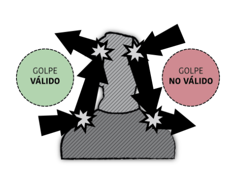

Si un impacto golpea de manera simultánea una zona de impacto no válida (como el cuello o la cabeza) y una zona de impacto válida, se considerará impacto válido. En caso de duda, siempre será el árbitro el que decida.

Si un jugador intenta emplear la cabeza de forma deliberada o repetida para parar o desviar golpes, el árbitro puede declarar ese golpe y los sucesivos como impactos válidos, pasando a ser la cabeza una zona válida para ese jugador.

### 5.2.2 Mano
Las manos que portan un arma no son zonas de impacto válidas. Las manos **NO** engloban las muñecas. Si un jugador es golpeado en la mano, deberá decir en alto «¡Mano!». Si un golpe primero hace contacto en la mano y luego en una zona de impacto válida, será considerado válido.

Se considerará que la mano sí es una zona de impacto válida cuando:

- Es la mano que porta un escudo.
- No se encuentra agarrando un arma.
- La mano agarra el arma, pero no se encuentra en la zona de agarre específica del arma.
- Se juega como cadenero o corredor.

Además, si el corredor porta el *jugg*, este también es zona de impacto válida para él.
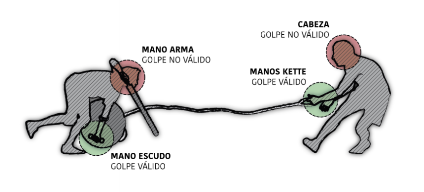

## 5.3 DOBLES
Si un jugador realiza un impacto mientras es impactado **al mismo tiempo** por otro jugador, se considera un impacto doble y todos los jugadores impactados deberán realizar su cuenta de penalización.

Si un jugador cree que ha hecho dobles deberá indicarlo gritando «¡Dobles!» para indicar al otro jugador y al árbitro su percepción del combate.

### 5.3.1 Al mismo tiempo
Según el sistema de juego, «al mismo tiempo» quiere decir que los impactos han de ser simultáneos. Si un árbitro es capaz de diferenciar los impactos, no se considerarán dobles, y el jugador que impactó primero no deberá arrodillarse. En caso de que el jugador que fue impactado primero sí note esa diferencia, deberá indicar al otro jugador que siga.

## 5.4 ARRODILLARSE
Arrodillarse es la acción que tiene que llevar a cabo un jugador que ha recibido un impacto válido y/o una falta y que consiste en poner como mínimo una rodilla en el suelo hasta que pase el tiempo de penalización. Durante este tiempo, el jugador debe cumplir las siguientes normas:

- Para poder iniciar su cuenta, ni el jugador ni su arma deberán estar trabada con otra.
- El jugador deberá arrodillarse en el lugar del campo que fue impactado. En caso de verse obligado a desplazarse, deberá regresar a la posición del impacto e iniciar su cuenta.
- Su arma deberá estar de manera horizontal y en el suelo.
- Si lleva un escudo, no podrá realizar la cuenta con la mano que lo porta. Además el escudo deberá permanecer agarrado en todo momento y no podrá usarse para cubrirse.
- Nunca se podrá sujetar un arma con la mano con la que se realiza la cuenta, aunque esta haya terminado.
- El *kette* podrá realizar la cuenta con el agarre en la muñeca.
- Deberá realizar su cuenta con la mano en la espalda.
- No podrá interferir negativamente en el desarrollo del juego.

Por **interferir negativamente** en el juego se entiende:

- Tumbarse en el suelo, es decir, bajar el pecho o la cabeza por debajo de la línea de la cadera o apoyar el brazo el tronco o la cabeza en el suelo.
- No colocar el *jugg* de manera claramente accesible al resto de jugadores.
- Desplazar, agarrar o bloquear un arma ajena.
- No dejar el arma en el suelo.
- Liberarse de un pineo.

Si un jugador arrodillado no está activo y realiza un impacto a otro jugador, se considerará que no respeta las condiciones descritas durante el tiempo de penalización ya que está influyendo negativamente en el desarrollo del juego y deberá ser sancionado con la falta correspondiente.

Existen una serie de acciones sin embargo que el jugador arrodillado tiene permitido realizar dado que **NO** influyen negativamente en el juego:

- Dirigir o dar órdenes al equipo.
- Sacar el *jugg* de la base tras un punto no válido.
- Destrabar el *kette* o facilitar su destrabe.
- Pivotar sobre la rodilla sobre la que se arrodilló siempre que no se libere del pineo.
- Protegerse de un impacto.
- Estirar o contraer el tronco.

Un jugador arrodillado podrá levantarse cuando:

- Termine su cuenta y no esté pineado.
- Se lo diga un árbitro.
- Se lo diga un adversario, que deberá indicar de forma visible para los árbitros este hecho.

Si un jugador apoya la rodilla en el suelo, deberá cumplir el tiempo de penalización. No se considera arrodillarse si el jugador apoya la rodilla en la transición de algún movimiento o se puede percibir de manera evidente que su acción no puede ser confundida con la realización de una penalización.

### 5.4.1 Tiempos de penalización
El tiempo de penalización es el tiempo que un jugador que ha recibido un impacto válido y/o una sanción ha de estar arrodillado como mínimo. No se empieza a contar hasta que el jugador apoya al menos una rodilla en el suelo y lleva su mano a la espalda. A partir de este momento, contará con los dedos de la mano, empezando con el puño cerrado y levantando un dedo por cada intervalo hasta que finalice su cuenta.

En caso de tener que contar más de 5 intervalos, cada múltiplo de 5 cerrará el puño y volverá a indicar la cuenta de uno en uno.

El jugador deberá mantener la posición de arrodillado en la medida de lo posible y podrá girar libremente siempre que mantenga su eje de giro sobre la misma rodilla sobre la que se apoyó. Una vez finalizado su tiempo de penalización podrá mantenerse arrodillado tanto tiempo como desee.

Todas las armas y faltas tienen un tiempo de penalización de 5 intervalos, con la excepción del *kette*, que penaliza con 8 intervalos.

## 5.5 REINCORPORARSE AL JUEGO

#### Atacar levantándose
Un jugador podrá atacar en cualquier momento una vez haya terminado su cuenta. Bajo este sistema un jugador será considerado activo en cuanto separe la mano de su espalda o levante la rodilla del suelo, pudiendo ser impactado de nuevo en ese momento.

## 5.6 PINEOS
Cualquier jugador arrodillado es susceptible de ser pineado. Para ello, otro jugador debe apoyar su arma en él. Un pineo es un tipo de impacto que evita que el jugador se levante, por lo que se rige por las mismas normas que estos con las siguientes excepciones:

- El *kette* no puede pinear ni golpear repetidamente a un jugador inactivo.
- No se puede pinear con un *kette* trabado en el arma.
- En vez de generar un tiempo de penalización, pinear bloquea a un jugador en el suelo mientras dure el pineo.
- No se puede pinear a dos jugadores a la vez, salvo que se usen duales.
- Se puede interrumpir el pineo en cualquier momento, incluso para golpear a otro jugador.
- Se puede golpear a un jugador con la misma arma mientras se pinea.
- No se puede alternar constantemente el pineo entre dos jugadores si se les impide intentar levantarse (es decir, si no se permite respetar al menos el intervalo del pineo).
- Un golpe directo no se considera un pineo. Para que un pineo se considere válido, hay que mantener el arma encima del jugador.
- Muchos golpes consecutivos casi inmediatos también se considerarán como un pineo.

Cuando un pineo finaliza puede ocurrir que el jugador arrodillado:

- **NO** haya terminado su cuenta, en cuyo caso este deberá terminarla para poder levantarse.
- **SÍ** haya terminado su cuenta, en cuyo caso este deberá esperar al siguiente intervalo para poder levantarse.

En ambos casos, si el intervalo suena justo cuando se está liberando el pineo, no será tenido en cuenta y habrá que esperar a que suene el siguiente.

## 5.7 CARGAS
Una carga es un golpe que realiza un jugador con alguna parte de su cuerpo o de su arma que no sea considerada zona de impacto sobre un oponente.

Si existe la posibilidad de que las trayectorias de los jugadores hagan que estos choquen en movimiento, deberán detenerse antes del impacto.

Se tendrán en cuenta las siguientes consideraciones:

- Un golpe con el cuerpo contra el cuerpo del rival o una zona de su arma que no produzca impactos válidos debe considerarse carga, independientemente de la intensidad del mismo.
- Un golpe entre dos armas, ya sea entre zonas de golpeo válidas o zonas que no produzcan impactos válidos, seguirá siendo un golpe entre armas y por lo tanto no será considerado carga.

El contacto físico entre jugadores del mismo equipo no es considerado carga, por lo que sí está permitido, siempre que no ponga en peligro su integridad física.

Siempre que un jugador **RECIBA** una carga y considere que la fuerza del golpe no ha sido significativa, es libre de indicar de manera visible para los árbitros al jugador que realizó la carga que continúe jugando y no lo considere falta. En todo momento es el jugador que recibe la carga el único con potestad para decidir: nunca podrá hacerlo el jugador que la realizó.

Las cargas son consideradas faltas y no producen impactos válidos. Esto es, si se realiza una carga con el fin de obtener cualquier tipo de ventaja a la hora de conseguir un golpe, el impacto no se considerará válido.

## 5.8 LUCHA DE CORREDORES
Los corredores pueden luchar entre ellos. Las técnicas que están permitidas son:

- Agarres sobre una zona válida.
- Levantamientos.
- Empujones con el hombro, torso o con los brazos y *hand offs*, siempre que se acompañe el movimiento con el propio cuerpo y nunca en la dirección de carrera del corredor rival.
- Estas acciones podrán realizarse en movimiento siempre que no pongan en riesgo la integridad física del corredor rival.

No están permitidos:

- Agarres sobre una zona no válida.
- Lanzamientos.
- Proyecciones, es decir, dejar caer al rival desde una altura o posición que ponga en peligro su integridad física.
- Puñetazos o patadas.
- Llaves o luxaciones.
- Zancadillas.
- Tirones de pelo.
- Agarres de la ropa.
- Cualquier otro agarre que el árbitro considere indebido.

Se considera zona válida:

- Si el corredor rival está levantado, todo el tronco y los glúteos. Se permiten agarres que engloben los brazos dentro del tronco.
- Si el corredor rival no está levantado (ergo en el suelo), se podrá agarrar y arrastrar además de las piernas y los brazos.
- En ningún caso se podrá interactuar con la cabeza, el cuello o los genitales.

Se entiende que un corredor está levantado cuando está en el aire o su único punto de apoyo con el suelo son uno o ambos pies.

#### Hand off

Se considera *hand off* un desplazamiento empleando el brazo o la mano para evitar un agarre realizado por el rival, desviarlo de su trayectoria o apartarlo de una posición estática. El *hand off* debe realizarse de la siguiente forma:

- Se debe acompañar el movimiento con la extremidad.
- No se puede iniciar con un impacto brusco.
- Solo se puede usar una extremidad para su realización. Se hará solamente con un brazo, nunca con los dos.

## 5.9 DENTRO Y FUERA DEL CAMPO
Se considerará que un jugador está fuera si con alguna parte de su cuerpo toca la línea que delimita el campo o más allá. Salirse del campo se considera una asistencia arbitral que el jugador deberá cumplir al regresar al campo, con las siguientes consideraciones:

- Si un jugador sale del campo por acción de otro jugador que ya está fuera o inactivo, no se considerará que ha salido.
- Un jugador impactado no puede salirse del campo y un jugador fuera del campo no puede ser impactado. Por lo tanto, estas acciones no acumularán tiempo de penalización.
- Las líneas del campo no se consideran parte del campo, por lo que tocarlas implica estar fuera. Sí podrá sobresalir del campo alguna parte del cuerpo, siempre y cuando no esté en contacto con la línea o con el suelo.
- Está permitido apoyar o tocar fuera del campo con un arma.

Asimismo, se considerará que el *jugg* está fuera si toca la línea que delimita el campo o más allá. Se considerará que ha lanzado el *jugg* fuera el último jugador que lo tocó, lo haya hecho o no de manera intencionada, y ya fuera con el cuerpo o con el arma.

Esta norma no aplica si un rival lanza el *jugg* de manera deliberada contra el jugador y por rebote el *jugg* acaba fuera. En este caso, el jugador que lo lanzó recibirá una falta grave y no se sancionará con ninguna penalización al jugador que recibió el impacto del *jugg* por sacarlo fuera.

Cuando el *jugg* es lanzado fuera del campo, el punto no se detiene y este tiene que regresar de inmediato dentro del campo. Si esto no ocurriera, el corredor está autorizado a salir del campo a recogerlo por el sitio más cercano y regresar dentro tan rápido como sea posible y por el mismo punto del campo por el que salió. Para ello deberá levantar el brazo indicando el propósito de su salida, y durante el tiempo que esté fuera del campo SÍ podrá ser impactado.

## 5.10 INDICAR AL CONTRARIO QUE CONTINÚE
Es obligatorio indicar a un oponente que siga jugando cuando nos ha golpeado primero, le hemos golpeado en la cabeza, o hemos realizado un golpe no válido que él sí ha interpretado como impacto. Esta indicación hay que realizarla tanto si se ha agachado como si no, y deberá hacerse de manera clara y visible para el jugador y equipo arbitral.

## 5.11 AGARRE INDEBIDO DEL ARMA
Un golpe realizado agarrando de forma indebida el arma no solo no produce un impacto válido, sino que está considerado falta, por lo que se deberá avisar al contrario y autoarbitrar la falta leve en el momento.

Esta norma también aplica a un escudo. Si este no se agarra de manera correcta, los impactos que realice ese jugador no serán válidos.

## 5.12 FONDOS CON EL *STAB*
Se entiende por fondeo todo aquel ataque que se realiza clavando la punta y moviendo el *stab* de atrás hacia adelante.

Los golpes realizados de esta manera con el *stab* no serán considerados impactos válidos. Tampoco se considerarán impactos válidos los golpes que se produzcan tras un fondo con el *stab*. Además este tipo de impactos serán considerados como falta, por lo que se deberá avisar al contrario y autoarbitrar la falta leve en el momento.

Sí serán considerados válidos todos los impactos que se realicen con la punta siempre que el golpe no haya sido producido por un fondo (golpe lateral que impacte solo con la punta) o aquellos en los que el oponente se golpeara contra la punta del *stab* por acción directa sin que el jugador que lo porta realice un ataque.

## 5.13 INTERACTUAR CON LAS BASES
Un corredor puede defender en la base siempre y cuando no obstruya el orificio de la misma y no la desplace deliberadamente. Se considerará que obstruye este orificio siempre que con alguna parte del cuerpo no permita que se pueda introducir el *jugg* en el mismo.

Si durante un forcejeo se desplazara la base, se intentará colocar de manera que no influya ni en la disputa ni en el resultado del punto.

Si esto resultara imposible, el árbitro principal procederá a resolver la acción de la manera más adecuada posible:

- Si el corredor atacante pudiera transformar un tanto de manera clara (es decir, sin oportunidad de que otro jugador lo evite) pero esto fuera imposible por no encontrarse la base en su lugar, el árbitro concederá el punto sin necesidad de colocar la base.
- Interrumpirá el punto para colocar la base y lo reanudará cuando estime oportuno.

Si las bases estuvieran ancladas al suelo y estas se desplazaran, sí se considerará falta del jugador que la desplazó.

## 5.14 ABANDONAR EL ARMA
Un jugador no puede abandonar su arma en el campo de manera voluntaria para intervenir en ninguna situación del juego.

En ningún caso se considerará abandono del arma en los siguientes casos:

- Soltar el arma en el suelo para realizar una cuenta de penalización.
- Ceder el arma a otro jugador para que destrabe estando inactivo.
- Soltar el *kette* para evitar un tirón peligroso en un jugador.

En caso de que se desprenda de su arma de manera involuntaria, se le seguirá considerando jugador activo, pero las únicas acciones que le estarán permitidas serán defenderse ante ataques (bloqueando o huyendo) y moverse por el campo para recuperar su arma. Cualquier otra acción será considerada abandono del arma y, por tanto, supondrá una falta.

Si un jugador resulta impactado en esta situación, podrá elegir recoger su arma antes de realizar la cuenta o después:

- Si recoge su arma antes, no acumulará más impactos, pero deberá iniciar la cuenta cuando regrese a la posición en la que fue impactado.
- Si recoge su arma después podrá iniciar la cuenta en el momento.

Un árbitro **NO** podrá intervenir para facilitar el arma a cualquier jugador inactivo.

## 5.15 JUGADORES ACTIVOS

Un jugador **ACTIVO** es aquel que está en juego. Las acciones de un jugador activo SÍ tienen validez.

Situaciones más comunes en las que un jugador está activo:

- Al entrar al campo en el inicio de un punto.
- Al separar la mano de su espalda o levantar una rodilla después de un tiempo de penalización.
- Al recuperarse del aturdimiento de un golpe en la cabeza.
- Al reanudar el partido tras una interrupción.

Por el contrario, un jugador **NO ACTIVO** es aquel que se considera que no está en juego. Las acciones de un jugador no activo **NO** tienen validez en el juego, pero sí podrán ser sancionadas.

Situaciones más comunes en las que un jugador no está activo:

- Cuando ha salido del campo.
- Cuando se le ha roto el arma y lo avisa.
- Cuando ha quedado aturdido tras ser impactado en la cabeza.
- Cuando ha sido impactado.
- Cuando ha cometido una falta o debe realizar un tiempo de penalización.
- Cuando el árbitro principal detiene el partido.

Un jugador no activo **NO** acumula tiempos de penalización por impactos excepto los siguientes casos:

- Aún no ha sido impactado.
- Ha cometido una falta y aún no se ha arrodillado.
- Las asistencias arbitrales *Lanzar el jugg fuera* y *Lanzar el jugg tarde*.

En todos los casos acumulará el tiempo de penalización del primer impacto que reciba.

Un jugador no activo **SÍ** acumula tiempos de penalización por faltas (salvo *Salirse del campo*).

## 5.16 DUALES
Se considera la combinación de dos espadas cortas como una combinación específica de armas con las siguientes reglas especiales:

- Un jugador que use esta combinación de armas puede atacar levantándose empuñando una única arma sin que se considere que no se agarra correctamente.
- Un jugador que use esta combinación de armas puede atacar con la otra espada si se desprende de una de manera por el motivo que fuera. Podrá recoger su espada en cualquier momento del punto o al finalizar el mismo.
- Un jugador que use esta combinación de armas podrá pinear a un jugador con cada una de sus espadas.

# CAPÍTULO 6: SANCIONES
**PARA EL CORRECTO FUNCIONAMIENTO DEL JUEGO Y MINIMIZAR LA ACCIÓN DEL EQUIPO ARBITRAL ES NECESARIO RESPETAR LAS REGLAS Y SEGUIR EL ESPÍRITU DEL JUGGER.**

Para ello, hay que ser **honesto, justo, objetivo y conocer las reglas**. A continuación, se detallan una serie de obligaciones para garantizar un juego limpio, deportivo y divertido:

- Respetar las decisiones arbitrales por encima de todo.
- Las discrepancias con el equipo arbitral deberán ser transmitidas únicamente por el capitán del equipo de manera clara y breve durante las pausas de juego, salvo que el equipo arbitral requiera la presencia de otros jugadores.
- Si existe duda sobre alguna regla es recomendable preguntar a los árbitros.
- En caso de duda sobre si ha recibido un impacto o realizado una falta, el jugador deberá cumplir la penalización correspondiente.
- Los jugadores deberán indicar de manera clara al contrario que sus golpes no son válidos para que continúe jugando.
- Cualquier discusión que surja en mitad del juego debe ser zanjada en la mayor brevedad posible, si hay dudas es preferible autoaplicar la sanción correspondiente (ambos implicados si es necesario).

## 6.1 AVISOS
Los avisos informan a algún jugador acerca de que ha estado a punto de cometer alguna acción antirreglamentaria llevada a cabo por descuido o por torpeza y que, de realizarse, sería sancionada. Los avisos los puede dar cualquier miembro del equipo arbitral mientras que se informe de ellos al árbitro principal.

Las situaciones en las que se puede dar un aviso son:

- A un jugador que no realice su cuenta correctamente (no incluye no completarla ni influir negativamente en el desarrollo del juego).
- A un jugador que apure mucho la entrada al campo en el inicio del punto.
- A un jugador que casi realiza una falta (p.ej., tarda un poco en agacharse, casi hace una carga, casi da un tirón con el arma).

La reiteración de estas acciones podrá acarrear una falta grave al jugador.

## 6.2 ASISTENCIA ARBITRAL
Una asistencia arbitral es una intervención por parte de un árbitro sobre una acción que puede requerir de su aclaración y puede implicar que el jugador deba arrodillarse y realizar una cuenta, pero por el tipo de acción no se considera una falta.

Normalmente este tipo de acciones generan confusión en el juego, por lo que el arbitro debe intervenir y asistir al jugador en la medida de lo posible. Si el jugador es consciente de cometer alguna de estas acciones puede actuar en consecuencia sin necesidad de la intervención del arbitro.

Las acciones definidas como asistencias arbitrales no son consideradas faltas como tales. La desobediencia arbitral por parte de un jugador ante una asistencia arbitral sí deberá ser considerada falta grave directa (y por lo tando acumulará 5 intervalos adicionales en el momento).

Las asistencias arbitrales posibles son:

- Salirse del campo.
- Entrar antes de tiempo.
- Lanzar el *jugg* fuera.
- Lanzar el *jugg* tarde.
- Golpe en la ropa.

### Salirse del campo
Por circustancias del juego a veces los jugadores tocan la línea que delimita el campo. Si un jugador se sale del campo, deberá realizar una cuenta de 5 intervalos arrodillándose en el punto donde se salió. Un jugador puede salirse del campo cuando desee.

No respetar esta penalización conllevará una falta grave indirecta (*Incumplir el tiempo de penalización*).

Más detalles en [5.9. Dentro y fuera del campo](#59-dentro-y-fuera-del-campo).

### Entrar antes de tiempo
Se considera que un jugador entra antes al campo si entra en contacto con el campo antes de que el árbitro principal grite «¡Jugger!» al comienzo de un punto.

En caso de que esto ocurra, el jugador deberá detenerse lo suficiente para no sacar ventaja de la acción y no deberá realizar ningún tipo de penalización.

Si a pesar de la asistencia arbitral el jugador persiste y obtiene ventaja, entonces será sancionado con falta grave directa.

### Lanzar el jugg fuera
En caso de que un jugador lance el *jugg* fuera del campo, este deberá añadir una penalización de 5 intervalos.

No respetar esta penalización conllevará una falta grave indirecta (*Incumplir el tiempo de penalización*).

Más detalles en [5.9. Dentro y fuera del campo](#59-dentro-y-fuera-del-campo).

### Lanzar el jugg tarde
En caso de que un jugador lance el *jugg* después de haber sido impactado, este deberá añadir una penalización de 5 intervalos.

No respetar esta penalización conllevará una falta grave indirecta (*Incumplir el tiempo de penalización*).

### Golpe en la ropa
En caso de que un jugador reciba un golpe (generalmente en la ropa) que el árbitro está seguro de que, por las circustancias del juego, el jugador no ha podido notar, este deberá añadir una penalización de 5 intervalos (8 en el caso de un impacto de *kette*).

No respetar esta penalización conllevará una falta grave indirecta (*Incumplir el tiempo de penalización*).

### 6.2.1 Tiempos de penalización
El tiempo de penalización de todas las asistencias arbitrales es acumulativo con otras faltas, otras asistencias arbitrales o con el tiempo de penalización por impacto.

Si un jugador ya se ha arrodillado (es decir, ya tiene al menos una rodilla en el suelo) o si se sale del campo y recibe un impacto, el tiempo de penalización del impacto no acumulará.

## 6.3 FALTAS
Las faltas son acciones ilícitas que van en contra del Reglamento y del espíritu del jugger. Podrán ser propuestas por cualquier miembro del equipo arbitral, aunque solo el árbitro principal podrá sancionarlas.

**NO** se podrá sancionar una falta del tipo que sea **si ningún miembro del equipo arbitral la ha visto**, es decir, por queja de un capitán o cualquier otra persona ajena al equipo arbitral.

### 6.3.1 Tiempos de penalización
El tiempo de penalización de todas las faltas es acumulativo con otras faltas, otras asistencias arbitrales o con el tiempo de penalización por impacto.

Si un jugador ya se ha arrodillado (es decir, ya tiene al menos una rodilla en el suelo) y recibe un impacto, el tiempo de penalización del impacto no acumulará.

### 6.3.2 Faltas leves
Las faltas leves son aquellas acciones que no cambian en exceso el resultado del partido ni repercuten de manera importante sobre el desarrollo del mismo.

Las faltas leves se producen en los siguientes casos:

- Cargas sobre un jugador.
- Realizar un pineo ilegal (doble, con el escudo o el *kette*, uso incorrecto del arma).
- Realizar tirones fuertes del arma o del *kette* cuando están trabados entre sí. El sancionado es aquel o aquellos que realizan los tirones.
- Golpear el *jugg* con el cuerpo (por ejemplo dar una patada), habiendo o no un arma entre el *jugg* y el cuerpo, a excepción de las manos del corredor.
- Realizar placajes o agarres indebidos a otro corredor.
- No respetar el intervalo después de un pineo.
- Atacar con una combinación de armas sin agarrarla correctamente (arma a dos manos con una mano, escudo no agarrado o no portando un elemento).
- Utilizar un arma agarrándola desde una zona diferente a la de agarre con el fin de obtener cualquier tipo de ventaja.
- Realizar un fondo con el *stab*.
- Romper el arma propia.
- El uso de fuerza desmesurada, tanto en lucha de corredores como a la hora de realizar impactos con un arma.
- Bloquear el orificio de la zona de marcaje.
- Bloquear o mover el arma a un jugador arrodillado de manera negativa para el dueño y por acción que no sea un lance del juego.
- Golpear de manera brusca con el cuerpo el arma de otro jugador.
- Agarrar el arma de otro jugador con las manos u otra parte del cuerpo, excepto si se está destrabando.
- Girar el *kette* si tiene un arma enrollada.
- El desplazamiento de una base de su posición original cuando esté anclada al suelo y ocurra como lance del juego.
- Incumplir el tiempo de penalización.

Una falta leve implica que el jugador sancionado se arrodillará durante un periodo de 5 intervalos en el momento en el que cometa la falta. Si un jugador comete una o más faltas leves mientras cumple con un tiempo de penalización, este deberá añadir al mismo los intervalos de penalización adicionales que corresponda.

El cumplimiento de esta sanción deberá ser aplicado por el jugador sin mediación del árbitro.

Se considerará que un árbitro ha intervenido cuando el jugador tuviera la intención de seguir jugando. Si el jugador se queda en el sitio **inmóvil**, sin interactuar hasta que el árbitro resuelva la acción, se considerará que el árbitro ha aclarado una situación del juego y **NO** se considerará falta.

El **NO** cumplimiento de la sanción correspondiente a una falta leve conllevará una falta grave.

La reiteración de faltas leves no implica ningún otro tipo de sanción.

### 6.3.3 Faltas graves
Las faltas graves son aquellas acciones voluntarias, antideportivas y/o que implican un comportamiento malicioso y que pueden incidir en un cambio en el resultado de un punto. Las faltas deben tener impacto en el juego, es decir sacar ventaja o influir en él, y además deben ir en contra del espíritu de la norma. También se castigarán aquellas acciones que, aun cometiéndose sin mala fe, se realicen de forma temeraria o negligente.

Si se detecta que un jugador ha realizado de manera voluntaria, con ánimo de sacar ventaja de la situación, alguna acción que pudiera ser sancionada con una falta leve o con un aviso, esta se sancionará siempre con una falta grave.

Existen dos tipos de faltas graves:

- Faltas graves indirectas.
- Faltas graves directas.

#### Faltas graves indirectas
Son aquellas que sancionan una falta leve no autoarbitrada. El jugador sancionado deberá cumplir la falta leve no autoarbitrada durante el punto en el que la haya cometido y, además, deberá cumplir un tiempo de penalización de 5 intervalos al inicio del siguiente punto, arrodillándose dentro del terreno de juego al comienzo del mismo.

#### Faltas graves directas
Son aquellas sancionadas directamente por el árbitro sin posibilidad de autoarbitraje. El jugador sancionado deberá cumplir un tiempo de penalización de 5 intervalos (8 en el caso de un impacto de *kette* no autoarbitrado) en el momento en el que el árbitro le sancione con la falta y, además, deberá cumplir un tiempo de penalización de 5 intervalos al inicio del siguiente punto, arrodillándose dentro del terreno de juego al comienzo del mismo.

#### Cumplimiento de sanciones
Independientemente del tipo de falta, la sanción al comienzo del siguiente punto será cumplida por aquella persona que cometió la falta, salvo que pase esta a ocupar una posición de prioridad menor según lo indicado en la siguiente tabla:

| Posición que cometió la falta | Posición que cumplirá la sanción           |
|-------------------------------|--------------------------------------------|
| *Kette*                       | *Kette* (*pompfer* si no sale un cadenero) |
| *Pompfer*                     | *Pompfer*                                  |
| Corredor                      | Corredor                                   |

Es decir, si es el *kette* el que comete la falta grave, la cumplirá el *kette*. En caso de que no salga un cadenero, la cumplirá otro *pompfer* en su lugar. Si la sanción la comete un *pompfer*, será otro *pompfer* el que la cumpla.

Si el jugador que cometió la falta no sale al comienzo del siguiente punto, la penalización deberá cumplirla aquella persona que ocupe su posición. Los tiempos de penalización al inicio de un punto derivados de faltas graves cometidas por un mismo equipo durante un mismo punto deberán ser cumplidos por jugadores diferentes.

El árbitro principal puede interrumpir el punto para hacer cumplir una falta grave al momento de ser cometida si lo cree necesario. Si un jugador resulta expulsado tras esto, no será expulsado hasta el final del punto, excepto en el caso de falta técnica.

Si un jugador comete una falta leve durante el juego y no se arrodilla, el árbitro **deberá** advertirle de su falta en el momento. Entonces, el jugador cumplirá la sanción de la falta grave indirecta. Si por circunstancias del juego el árbitro no pudiera sancionar la falta en el momento, **deberá** hacerlo al finalizar el punto. **Una falta grave vista por un árbitro nunca deberá quedarse sin sancionar.**

Las **faltas graves directas** se producen en los siguientes casos:

- Realizar acciones que pongan en peligro la integridad de otros jugadores.
  - Juego peligroso.
  - Cargas.
  - Golpes muy fuertes.
  - Golpear a alguien voluntariamente con alguna parte del cuerpo.
  - Lanzar el *jugg* contra un jugador o fuera del campo de forma intencionada.
  - Jugar con un arma rota o peligrosa.
- No marcar un punto cuando se está en clara disposición de poder hacerlo sin que un oponente lo pueda evitar (perder tiempo).
- Abandonar la zona de equipo sin causa justificada.
- No realizar el tiempo de penalización voluntariamente tras cometer una falta leve o recibir una asistencia arbitral o un impacto.
- Intervenir en el juego de forma directa (acciones no verbales) durante el tiempo de penalización o de inactividad. Excepciones: ayudar a destrabar el *kette* y sacar el *jugg* de la marca cuando el tanto no es válido.
- Interferir en el desarrollo del partido de manera negativa por parte de un jugador que no participa en el punto.
- Impedir voluntariamente el destrabe del *kette* una vez que se ha recibido un impacto válido.
- No soltar el *kette* de su agarre de manera **inmediata** cuando se trabe a un jugador y se ponga en peligro su seguridad.
- Abandonar un arma en el campo.
- Trato irrespetuoso a espectadores, equipo arbitral o jugadores.
- Desobediencia al equipo arbitral.
- Tomar decisiones arbitrales y comunicarlas al resto de jugadores generando confusión (no confundir con repetir las decisiones del equipo arbitral).
- Discusión con algún miembro del equipo arbitral durante el transcurso de un punto.
- Detener el juego innecesariamente (prolongar discusiones arbitrales en una decisión aplicada).
- Simular haber sido golpeado por algún arma o jugador.
- Simular una lesión que no es real o exagerarla.
- Que un jugador que no sea el capitán se dirija al equipo arbitral para emitir una reclamación.
- Tratar de sacar ventaja de una interrupción del juego.
- Por cualquier otro motivo que el equipo arbitral considere sancionable gravemente.

Al igual que en el caso de las faltas leves, si un jugador comete una o más faltas graves mientras cumple con un tiempo de penalización, este deberá añadir al mismo los intervalos de penalización adicionales que corresponda.

En caso de reinicio de un punto deberán comenzar cumpliendo los tiempos de penalización pertinentes:

- Aquellos jugadores sancionados con falta grave durante el punto que se decida reiniciar.
- Aquellos jugadores que saldrían abajo al inicio del punto reiniciado.

### 6.3.4 Acuerdo entre jugadores
En caso de acuerdo entre jugadores el árbitro podrá mostrar su opinión, pero prevalecerá el acuerdo entre los jugadores, siempre que sean acciones dentro del campo de su libre disposición.

No puede darse acuerdo entre jugadores en los siguientes casos:

- Acciones en contra del Reglamento.
- Juego peligroso.
- Uso de armas ilegales o rotas.
- Antideportividad.
- Apología política.
- Empleo de elementos ajenos a la equipación estrictamente necesaria que puedan poner en riesgo la integridad física de los jugadores.

### 6.3.5 Falta penal
Si un jugador evita la consecución de un tanto claro con una falta, se sanciona con falta penal otorgando el tanto y aplicando las sanciones que correspondan.

Toda aquella falta grave que evite la consecución de un tanto de manera directa y deliberada, será considerada a efectos de acta como una falta grave directa.

No se considera falta penal cuando se detiene el juego y un equipo está en posición de marcar (corredor en solitario, o corredor y *pompfer* contra corredor), pero SÍ que se concede el punto.

### 6.3.6 Expulsiones
La expulsión es una sanción por la cual un jugador amonestado con ella no podrá volver a jugar ningún punto en lo que reste de partido. No obstante, otro jugador del equipo podrá ocupar su puesto y salir en su lugar.

Si se expulsa al capitán se procederá a sustituirlo por cualquiera de los otros miembros no expulsados del equipo, informando al equipo arbitral de la persona que ocupa el lugar y empleando esta la simbología oportuna. Un jugador expulsado sigue constando en el acta arbitral, y por ello es susceptible de recibir sanciones (como faltas graves o técnicas) después de su expulsión.

Se contemplan dos tipos de expulsiones:

#### Descalificación
Acumulación de dos faltas graves durante el transcurso de un partido. El jugador será expulsado, pero podrá permanecer en su zona de equipo. La expulsión se hará efectiva al finalizar el punto en el que el jugador haya cometido su segunda falta grave.

#### Falta técnica
Falta técnica es aquella que se comete contra el espíritu del deporte, supone un flagrante riesgo para la seguridad o atenta contra la autoridad del equipo arbitral y constituye un tipo de sanción por la que un jugador será expulsado y no tendrá permitido situarse en las inmediaciones del campo.

Se han de tener en cuenta las siguientes consideraciones:

- El árbitro podrá interrumpir el partido para expulsar a un jugador con una falta técnica.
- La falta técnica computa como dos faltas graves para ese jugador y para el cómputo total del equipo.
- Una falta técnica implicará el cumplimiento de dos faltas graves al inicio del siguiente punto que deberán ser cumplidas por dos jugadores diferentes.
- Una falta técnica computa como dos faltas graves directas para ese jugador y para el cómputo total del equipo.

Puede aplicarse una falta técnica en el momento en que un jugador lleve a cabo una acción que el árbitro considere merecedora de una expulsión directa, entre otras:

- Juego peligroso desmesurado.
- Falta de respeto al equipo arbitral, público o equipo rival.
- Transmitir una imagen de violencia excesiva en el deporte.
- Lesionar a un rival o compañero de forma intencionada.
- Agresión física o verbal.
- Empleo de lenguaje obsceno o grosero.
- Apología política.
- Antideportividad.
- Intervención directa de un jugador expulsado en el desarrollo del partido.
- No acatar las indicaciones arbitrales durante el partido.

# CAPÍTULO 7: ARBITRAJE

## 7.1 EQUIPO ARBITRAL
El jugger es un deporte autoarbitrado en el que los jugadores deben comunicarse para solventar las posibles disputas que surjan. En caso de que los jugadores no resuelvan estas disputas, deberá decidir el equipo arbitral según este Reglamento velando por las reglas del juego y su buen hacer.

Para ser árbitro se exigirán las siguientes condiciones:

- Acreditar un conocimiento extenso sobre el *Reglamento de Jugger* y aceptarlo.
- Conocer y aceptar la *Normativa Arbitral*.
- Superar los cursillos arbitrales.

Los componentes del equipo arbitral tienen poder absoluto sobre el juego y se deben seguir sus órdenes. Además, deberán estar correctamente identificados como tales. Los árbitros desempeñan las siguientes funciones:

- Dirigir el juego.
- Hacer respetar las reglas y el espíritu del juego.
- Hacerse cargo de la seguridad del juego.
- Interrumpir el juego si un jugador resulta dañado o en situaciones especiales.
- Tomar decisiones en situaciones dudosas.
- Devolver el *jugg* al campo si se sale.
- Informar al árbitro principal de cualquier situación pertinente.

Toda la información para realizar un correcto arbitraje se encuentra detallada en la ***Normativa Arbitral***.

## 7.2 COMPONENTES
El equipo arbitral estará compuesto, como mínimo, por los siguientes componentes:

- Árbitro principal.
- Árbitro secundario.
- Dos árbitros de zona de marcaje.
- Contador/es.

### 7.2.1 Principal
El árbitro principal es el máximo responsable un partido. El árbitro principal debe estar a la misma altura que el *jugg* en el lateral del campo al comienzo del punto. Además, en situaciones dudosas, tiene la última palabra. Aparte, tiene las siguientes tareas:

- Dar comienzo a cada uno de los puntos.
- Detener y reanudar el juego tras las interrupciones y pausas.
- Anunciar el resultado y el tiempo de juego cuando algún capitán lo solicite.
- Dar validez a los tantos conseguidos.
- Avisar de las faltas sancionadas.
- Asegurar que el *jugg* está en la posición correcta al inicio de cada punto.
- Hacer que el juego se lleve a cabo correctamente, comprobando los tiempos de penalización y los impactos.
- Determinar *juego pasivo* cuando sea necesario.

### 7.2.2 Secundario
Su función esencial es la de prestar apoyo en todo momento al árbitro principal. Sus funciones son muy similares a las del árbitro principal. No obstante, es el árbitro principal el que tiene la última palabra en todas las decisiones. También deberá apoyarle al comienzo del punto.

Al comienzo de cada punto, este se sitúa en el centro del campo, tras la línea lateral, en el extremo opuesto al árbitro principal.

### 7.2.3 Base
Es el árbitro que se sitúa cerca de la zona de marcaje y cuyas funciones se centran fundamentalmente en informar sobre los tantos y sobre la salida de los jugadores al comienzo de cada punto.

Aparte de las comunes, sus tareas son:

- Anunciar la consecución de un tanto (levantando los brazos y gritando «¡Tanto!» o «¡*Jugg*!»). No obstante, es misión del árbitro principal pitar la concesión de un tanto de manera definitiva.
- Anunciar un tanto no válido (gritando «¡No!» y levantando los brazos en forma de X por encima de su cabeza). En este caso, también es misión de estos árbitros sacar el *jugg* de la zona de marcaje en caso de que no lo haga alguno de los corredores.
- Asegurarse de que los jugadores estén correctamente posicionados en la línea de base y que no salgan al terreno de juego jugadores de más (ni más de 5 en juego ni más de 10 en total en el partido).
- Controlar que los jugadores no comiencen el juego antes de tiempo y sancionar a los jugadores que lo hagan.

### 7.2.4 Contador
Aunque forma parte del equipo arbitral, no se trata de una figura de autoridad sobre los jugadores y no debe hacer respetar las reglas del juego.

Su labor es auxiliar al árbitro principal en la gestión del partido. Son los encargados de llevar el seguimiento del juego, contando los tantos y los sets o intervalos según corresponda.

Cuando tenga lugar, deberán realizar la cuenta atrás de los últimos diez intervalos de cada parte del partido.
